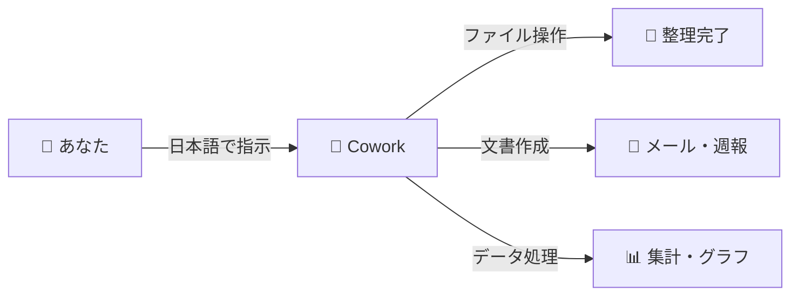

# 非エンジニアでもCoworkを使いこなす方法

:::message
**この記事でわかること**
- 🎯 プログラミング知識ゼロでもCoworkは使えるか → **結論：使える**
- ⏱️ 事務作業がどれくらい速くなるか → **週報30分→5分、ファイル整理1時間→2分**
- ❌ 実際に失敗したこと2つと、その具体的な対処法
- 📋 そのままコピペで使えるプロンプトテンプレート4選
:::

## 🎯 はじめに — エンジニアじゃなくてもAIは使える

「AIツールって、プログラミングできないと使えないんでしょ？」

自分も最初はそう思っていました。でも、Claude Coworkを1週間使ってみた結果がこちらです：

| タスク | Before | After | 削減率 |
|--------|--------|-------|--------|
| 週報作成 | 30分 | 5分 | **83%** |
| ファイル整理（100個） | 1時間 | 2分 | **97%** |

**コードは一行も書いていません。日本語だけです。**

この記事では、プログラミング経験ゼロの自分が実際にCoworkを使ってみた体験をもとに、非エンジニアでも安心して使える方法をシェアします。

失敗したことも、すべて正直に書きます。

## 🔧 Coworkの仕組みを理解しよう

技術的な詳細は抜きにして、**最低限知っておくべきこと**だけ説明します。

### Cowork = あなたのデスクトップアシスタント

簡単に言うと、Coworkは**あなたのPC上で働く優秀なアシスタント**です。

**イメージ図：**



### セキュリティについて — サンドボックスとは？

Coworkは「サンドボックス」という仕組みで動いています。

**サンドボックス = 砂場**のイメージです。子どもが砂場で遊んでも、砂場の外には影響がないように、Coworkも**指定したフォルダの中だけ**で動作します。

**具体的には：**
- 初回起動時に「作業フォルダ」を選択します
- Coworkはそのフォルダ内のファイルだけを操作できます
- フォルダ外のファイルは一切触れません


だから、**大事なファイルが入っていない専用フォルダ**を作って、そこで練習するのがおすすめです。

### ファイルアクセスの許可

Coworkがファイルを操作するときは、毎回**確認ダイアログ**が表示されます。


勝手にファイルを削除されることはないので、安心してください。

## 🧪 非エンジニアの自分が最初にやってみた5つのこと

実際に試した手順を、そのまま時系列で紹介します。

### ① Claude Desktopをインストール

公式サイト（[https://claude.com/download](https://claude.com/download)）からClaude Desktopアプリをダウンロードします。

**所要時間：** 5分

**注意点：**
- Proプラン ($20/月) の登録が必要です
- 最初の7日間は無料トライアルがありました（2026年2月時点）


### ② 安全な作業フォルダを選択

デスクトップに「cowork-demo」という名前のフォルダを新規作成しました。

**なぜテストフォルダを作ったか：**
- 大事なファイルを誤って操作されないため
- 気軽に試行錯誤できるため
- いつでも削除してやり直せるため


この判断は正解でした。最初は失敗も多かったので。

### ③ 最初のタスク: メモを作成してみた

一番シンプルなタスクから始めました。

**入力したプロンプト：**
```
今日の日付でメモファイルを作成してください。
タイトルは「はじめてのCowork」にしてください。
```

**結果：**
- ファイル名「20260218_はじめてのCowork.txt」が生成されました
- 所要時間：約10秒


**感想：** 想像以上に簡単！これならできそうと思えました。

### ④ ファイル整理タスク: フォルダを自動整理

次に、少し複雑なタスクに挑戦しました。

**準備：**
- テストフォルダに50個のダミーファイル（画像、PDF、Excel、Word）を配置
- わざとバラバラに配置して、整理タスクを依頼

**入力したプロンプト：**

:::details プロンプト全文（コピペOK）
```
このフォルダのファイルを種類別に整理してください。

【分類ルール】
- 画像ファイル → 「images」フォルダ
- PDFファイル → 「documents」フォルダ
- Excel/Word → 「office」フォルダ
- その他 → 「others」フォルダ

元のファイル名は変更しないでください。
```
:::

**結果：**
- 4つのフォルダが自動作成されました
- 50個のファイルが正しく分類されました
- 所要時間：約2分

**整理前：** 51個のファイルがバラバラに配置


**整理後：** 4つのフォルダに自動分類


**感想：** 手動でやったら30分以上かかる作業が、一瞬で終わった！

## ✍️ プロンプトの書き方 — 非エンジニア版

4つのタスクを試してみて、**プロンプトの書き方にコツがある**と気づきました。

### 基本の3原則

✅ **具体的に書く** - 曖昧な指示は曖昧な結果になる
✅ **条件を明記する** - フォーマット、長さ、スタイルを指定する
✅ **文脈を伝える** - 背景や目的を説明すると精度が上がる

### ❌ 悪い例 vs ✅ 良い例

**例1: ファイル整理**

❌ 悪い例:
```
ファイルを整理して
```

✅ 良い例:
```
このフォルダのファイルを種類別にサブフォルダに整理してください。
画像は「images」、文書は「documents」に分類してください。
元のファイル名は変更しないでください。
```

---

**例2: 報告書作成**

❌ 悪い例:
```
報告書を作って
```

✅ 良い例:
```
以下のメモから、上司向けの週次報告書をWord形式で作成してください。
セクションは「今週の成果」「来週の予定」「課題」の3つで、
A4で1ページ以内にまとめてください。
```

### よく使うプロンプトテンプレート

実際に使って便利だったテンプレートを4つ紹介します。

#### テンプレート1: 週報作成
```
以下のメモから、上司向けの週次報告書をWord形式で作成してください。

【メモ】
〇〇

【フォーマット】
- タイトル：週次報告書（〇月〇日〜〇月〇日）
- セクション：今週の成果、来週の予定、課題・懸念事項
- 箇条書き形式
- A4で1ページ以内
```

#### テンプレート2: フォルダ整理
```
このフォルダのファイルを種類別にサブフォルダに整理してください。

【分類ルール】
- 画像ファイル → 「images」フォルダ
- 文書ファイル → 「documents」フォルダ
- Excel/CSV → 「data」フォルダ
- その他 → 「others」フォルダ

【条件】
- 元のファイル名は変更しない
- 空のフォルダは作成しない
```

#### テンプレート3: データ集計
```
このCSVデータを分析して、以下の集計を行ってください。

【集計内容】
- 月別の合計
- カテゴリ別の内訳
- 前月比の計算

【出力】
- Excelファイルで出力
- 集計表とグラフを含める
```

#### テンプレート4: 比較表作成
```
〇〇と△△を比較する表をExcelで作成してください。

【比較項目】
- 価格
- 機能
- サポート
- 評価

【フォーマット】
- 横軸：比較対象
- 縦軸：比較項目
- 総合評価も追加
```

これらは、そのまま〇〇の部分を埋めて使えます。

## ❌ よくある失敗と対処法

自分が実際に失敗したことと、その解決方法をシェアします。

### 失敗1: 指示が曖昧すぎた

**やったこと：**
```
資料を作って
```

**結果：**
「どんな資料ですか？」と聞き返されました。

**対処法：**
具体的に書き直しました。
```
〇〇についてのプレゼン資料を、PowerPointで5枚のスライドで作成してください。
構成は「課題」「提案」「効果」「スケジュール」「まとめ」でお願いします。
```

### 失敗2: 期待値が高すぎた

**やったこと：**
「このPDFを読んで、完璧な提案書を作って」と依頼しました。

**結果：**
出力された提案書は、構成は良いものの、細かい調整が必要でした。

**学んだこと：**
Coworkは「たたき台を作るツール」として使うのがベスト。最終的な調整は人間が行う前提で使うと、ストレスなく使えます。

## 💼 実際の活用事例3選

1週間使ってみて、実用的だった事例を紹介します。

### 事例1: デスクトップのファイル整理

**状況：**
デスクトップに100個以上のファイルが散らかっていました。

**やったこと：**
```
Desktopフォルダのファイルを整理してください。

【分類ルール】
- 2026年のファイル → 「2026」フォルダ
- 2025年以前 → 「archive」フォルダ
- さらに各フォルダ内で種類別に分類

【条件】
- 日付はファイルの更新日を使用
- ファイル名は変更しない
```

**結果：**
- 100個のファイルが5つのフォルダに整理されました
- 所要時間：約2分（手動なら1時間以上）

**整理前：** 100個のファイルがバラバラ


**Coworkが処理中：**


**整理後：** 年別に2つのフォルダに分類


**archiveフォルダの中：** さらに種類別に分類


**効果：**
デスクトップがスッキリして、必要なファイルがすぐ見つかるようになりました。

### 事例2: 週報の自動生成

**状況：**
毎週金曜日に上司へ週報を提出する必要がありました。

**やったこと：**
1週間分の簡単なメモを用意しました。
```
【メモ】
月: 顧客A社訪問（新サービス提案）、提案書v2作成
火: 部門会議、B社向け見積3件作成
水: 顧客C社オンライン商談（30分）、議事録整理
木: 新人研修資料の更新、問い合わせメール5件対応
金: 月次データの確認、来週のアポ調整
```

そして以下のプロンプトで週報を依頼：
```
以下のメモから、上司向けの週次報告書をWord形式で作成してください。

【メモ】
（上記のメモを貼り付け）

【フォーマット】
- タイトル：週次報告書（2月16日〜2月20日）
- セクション：今週の成果、来週の予定、課題・懸念事項
- 箇条書き形式
- A4で1ページ以内
```

**結果：**
- きちんとした体裁の週報が3分で完成しました
- そのままWordファイルとして保存されました


**効果：**
週報作成時間が30分 → 5分に短縮されました。

### 事例3: 競合調査の比較表作成

**状況：**
チームで使うプロジェクト管理ツールを選定する必要がありました。

**やったこと：**
```
以下の3つのプロジェクト管理ツールを比較する表をExcelで作成してください。

【対象】
- Backlog、Notion、Asana

【比較項目】
- 月額料金（10人チームの場合）
- 日本語対応
- ガントチャート機能
- モバイルアプリ
- サポート体制（日本語サポートの有無）
- 無料プランの制限

【フォーマット】
- 横軸：3ツール
- 縦軸：比較項目
- 見やすい表形式で
```

**結果：**
- 比較表が自動生成されました
- 各ツールの最新料金は自分で確認して修正しました


**効果：**
Excelのフォーマット作成時間が20分 → 1分に短縮されました。

## ⚠️ 正直に言うと微妙だった点

使ってみて「うーん...」と思ったことも正直に書きます。

### 微妙①：最初のプロンプト作成に時間がかかる

慣れるまでは「どう指示すればいいか」を考えるのに時間がかかりました。最初の1〜2日は、プロンプトを書く時間のほうが手作業より長かったです。

**ただし**、一度テンプレートを作ってしまえば、2回目からは一瞬です。

### 微妙②：複雑なレイアウトの文書は苦手

Wordの表やグラフが入った報告書は、レイアウトの微調整が必要でした。テキストベースの文書は得意ですが、見た目にこだわる資料は人間の仕上げが必須です。

### 微妙③：月額$20のコスト

Proプラン月額$20（約3,000円）は、頻繁に使わない人には高いかもしれません。自分の場合、毎日使って**月10時間以上の時短**ができているので十分元は取れていますが、週1回程度なら無料ツールでも十分かもしれません。

## 📊 まとめ

非エンジニアの自分が1週間Coworkを使ってみた結果です。

### 数字で見る効果

| 指標 | 結果 |
|------|------|
| 事務作業の時間削減 | **83〜97%**（タスクによる） |
| プログラミング知識 | **一切不要** |
| セットアップ時間 | **約10分で開始** |
| 月間の時短効果 | **週報だけで月2時間** |

### 使いこなすコツ3つ

✅ **具体的な指示を心がける** — 曖昧な指示は曖昧な結果になる
✅ **テンプレートを作っておく** — よく使うタスクはプロンプトを保存
✅ **8割完成ツールと割り切る** — 最終調整は人間が行う前提で使う

### 注意点

⚠️ **最初は専用フォルダで練習** — 大事なファイルがあるフォルダは避ける
⚠️ **100%完璧は期待しない** — 8割完成を目指して、残り2割は自分で調整
⚠️ **機密情報の扱いに注意** — セキュリティポリシーを確認してから利用

---

**毎週プロンプト実験の結果を公開しています** → [@cowork_labs](https://x.com/cowork_labs) をフォローで見逃さない！

📌 関連記事 → [Claude Coworkとは？初心者向け完全ガイド](https://qiita.com/corwork_lab/items/e8561cf04fb94ed456cc)
📝 [Qiita](https://qiita.com/corwork_lab) | 🐦 [X](https://x.com/cowork_labs)

---

**皆さんはどんな事務作業を自動化したいですか？** コメントで教えてください！実際に試して結果をシェアします。
